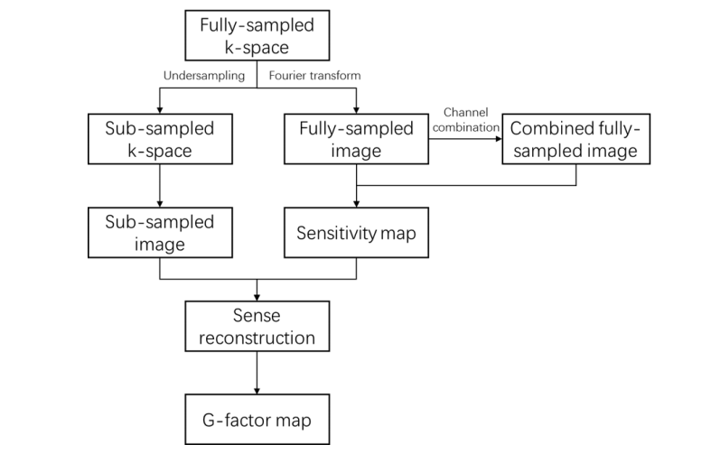
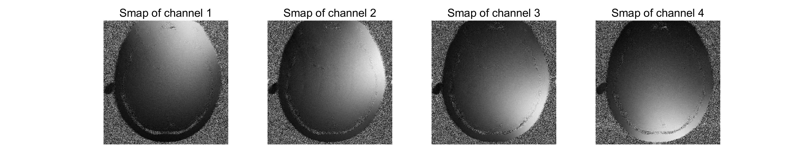
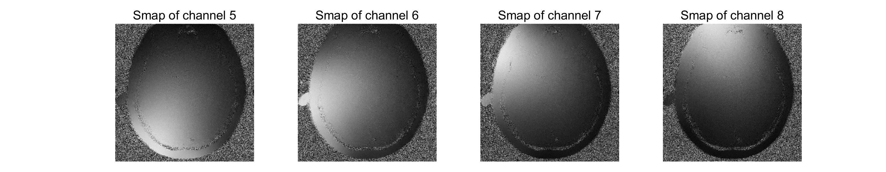
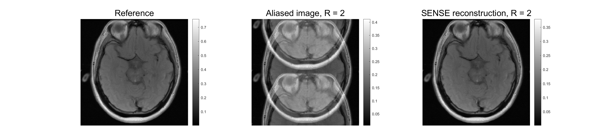
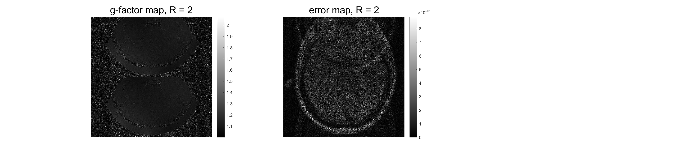
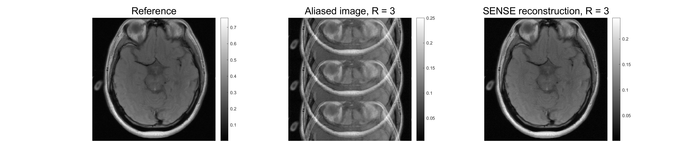
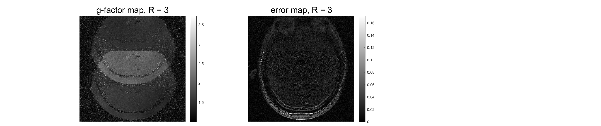
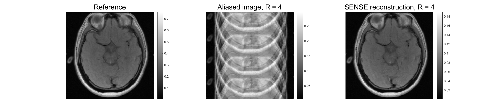
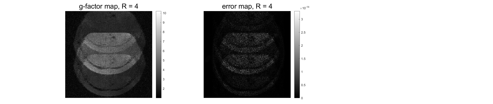

# Project 1: SENSE Reconstruction

 

[TOC]

 

## 1. Theory

### 1.1 Mathematical description

- According to the theory of Fourier transform, downsampling in frequency domain by factor $R$, will cause the image to be cyclically extended by period $L/R$ ($L$ is the length of data) in spatial domain.

- Then, the alised voxels are as below

$$
\begin{aligned}
\begin{bmatrix}
I_0(y) \\ I_1(y) \\ \vdots \\ I_{N_c-1}
\end{bmatrix} &=
\begin{bmatrix}
C_0(y)       & \cdots & C_0(y + (N_A-1)L/R)     \\
C_1(y)       & \cdots & C_1(y + (N_A-1)L/R)     \\
\vdots       & \vdots & \vdots                  \\
C_{N_c-1}(y) & \cdots & C_{N_c-1}(y + (N_A-1)L/R)
\end{bmatrix}
\begin{bmatrix}
m(y) \\ m(y+L/R) \\ \vdots \\ m(y+(N_A-1)L/R)
\end{bmatrix} \\
I &= Cm
\end{aligned} \tag{1}
$$

&emsp;&emsp; In which, $C$ and $I$ are sensitivity maps and alised image of each channel respectively, and $N_c$ is the number of channels, $N_A = L/R$. Then the unfolded voxels are

$$
m = \left(C^{H}\Phi^{-1}C \right)^{-1} C^{H}\Phi^{-1}I \tag{2}
$$

&emsp;&emsp; $\Phi$ is the $N_c \times N_c$ coil noise correlation matrix. The coil sensitivity images are

$$
\begin{aligned}
C_j = \frac{I_j}{I} = \frac{I_j}{\sqrt{\sum_i (\vert I_i \vert^2 / \sigma_i^2)}} \;,\; j = 1,2,\cdots,N_c
\end{aligned}\tag{3}
$$

&emsp;&emsp; The factor $\mathrm{g}$ is

$$
g_i = \sqrt{[\left(C^{H}\Phi^{-1}C \right)^{-1}]_{ii} \left(C^{H}\Phi^{-1}C \right)_{ii}} \tag{4}
$$

 

### 1.2. Flow chart

- Using Fourier transform (FT) to reconstruct the full-sampled k-space, and then combine all channel through sum of square
- Compute the sensitivity map according to the equation (3)
- Undersample in k-space by acceleration factor $R$, and then obtain the sub-sampled image  by FT
- Perform SENSE reconstruction according to equation (1).

</img>

<b>Figure 1.</b> SENSE reconstruction flow chart

 

## 2. Results

- The program execution begins and ends in file `project1.m`. Function `senseKernel()` realizes the SENSE algorithm.

</img>
</img>

<b>Figure 2.</b> Sensitivity maps

 

</img>
</img>

<b>Figure 3.</b> Acceleration factor R = 2

 

</img>
</img>

<b>Figure 4.</b> Acceleration factor R = 2

 

</img>
</img>

<b>Figure 5.</b> Acceleration factor R = 2

