# Project 2: GRAPPA Reconstruction

 

[TOC]

 

## 1. Theory

- In GeneRalized Autocalibrating Partially Parallel Acquisitions (GRAPPA), extra Nyquist-sampled k-space lines are acquired during the parallel imaging scan and are used to calculate the weighting factors that determine the missing k-space data.

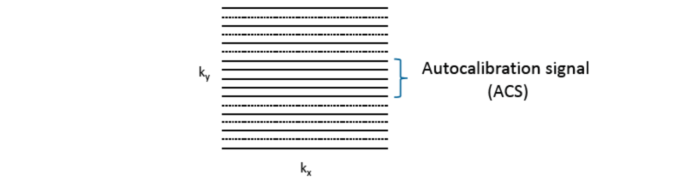</img>

<b>Figure 1.</b> ACS lines

- As in **Figure 2**, a GRAPPA weights is firstly estimated using the full-sampled ACS lines. According to the translation invariance property of the weighting matrix, we can compute the missing data using GRAPPA weights.

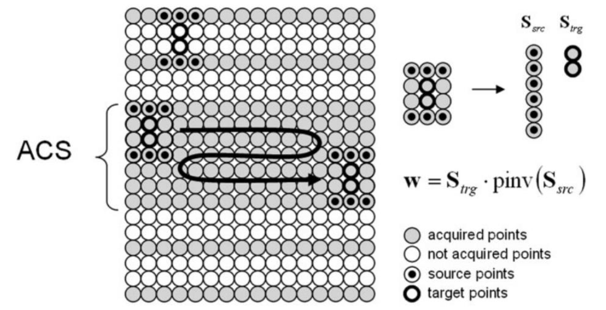</img>

<b>Figure 2.</b> GRAPPA kernel

<b>Figure 3.</b> Flow chart of GRAPPA reconstruction

 

## 2. Results

- The program execution begins and ends in file `project2.m`. Function `grappa_2d.m` realizes the GRAPPA algorithm.

 

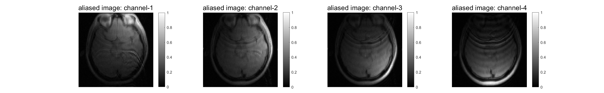</img>
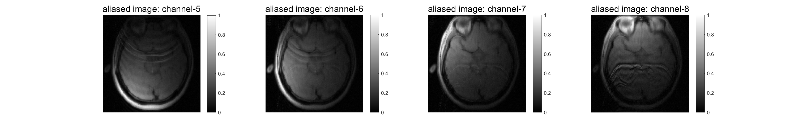</img>

<b>Figure 4.</b> Aliased images, R = 2, ACSLine = 24

 

</img>
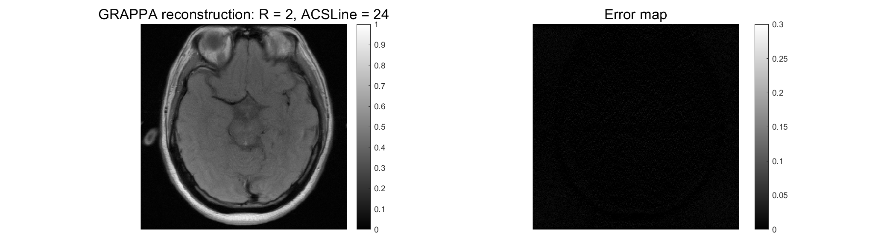</img>

<b>Figure 5.</b> Results of GRAPPA reconstruction, R = 2, ACSLine = 24

 

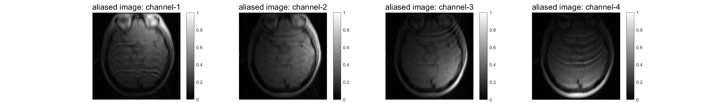</img>
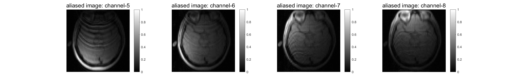</img>

<b>Figure 6.</b> Aliased images, R = 3, ACSLine = 24

 

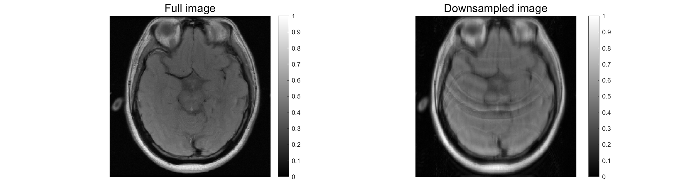</img>
</img>

<b>Figure 7.</b> Results of GRAPPA reconstruction, R = 3, ACSLine = 24

 

</img>
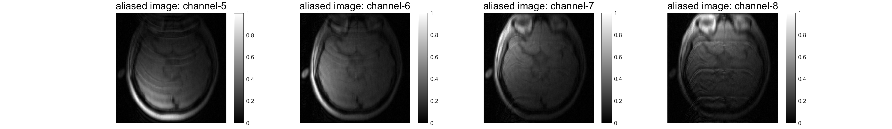</img>

<b>Figure 8.</b> Aliased images, R = 4, ACSLine = 24

 

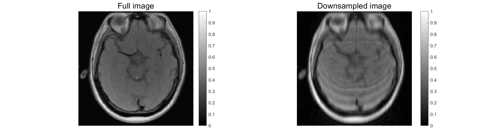</img>
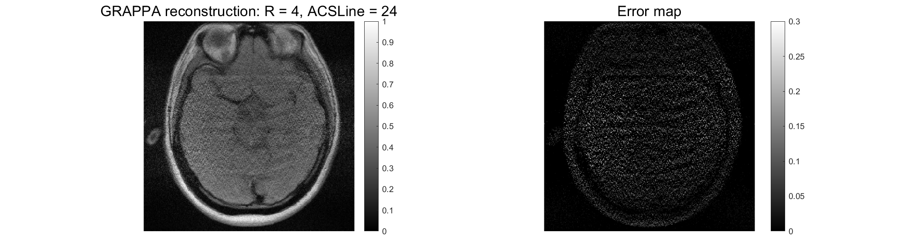</img>

<b>Figure 9.</b> Results of GRAPPA reconstruction, R = 4, ACSLine = 24

 

</img>
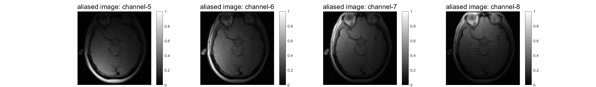</img>

<b>Figure 10.</b> Aliased images, R = 2, ACSLine = 48

 

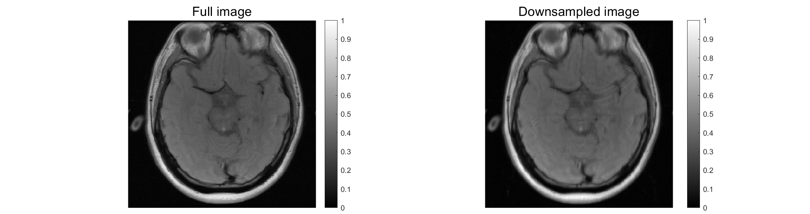</img>
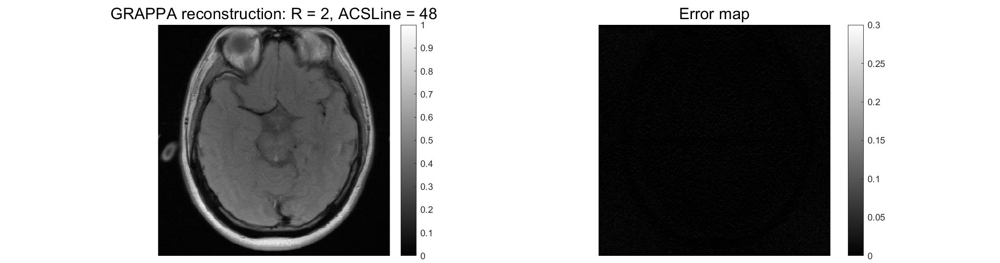</img>

<b>Figure 11.</b> Results of GRAPPA reconstruction, R = 2, ACSLine = 48

 

</img>
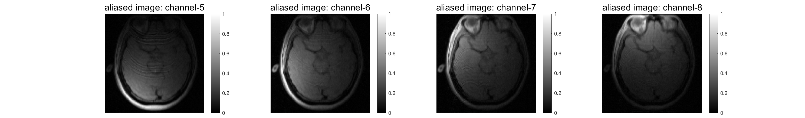</img>

<b>Figure 12.</b> Aliased images, R = 3, ACSLine = 48

 

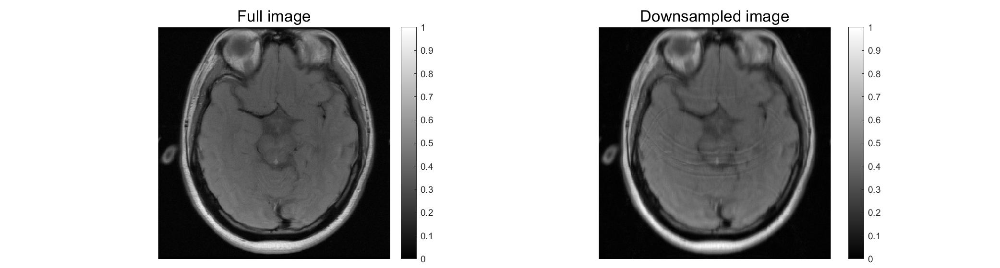</img>
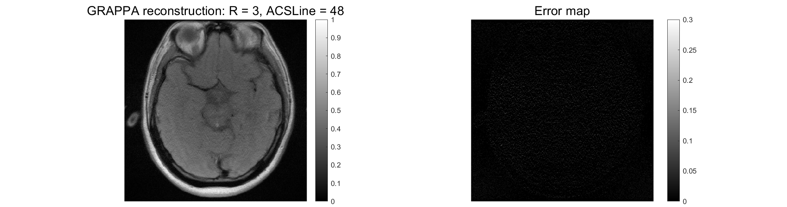</img>

<b>Figure 13.</b> Results of GRAPPA reconstruction, R = 3, ACSLine = 48

 

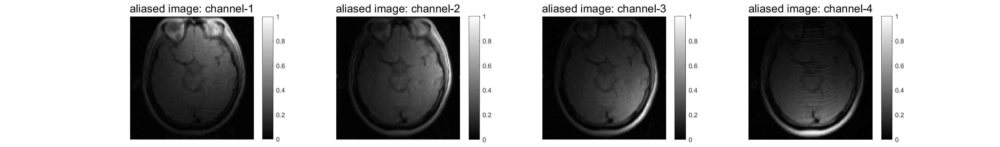</img>
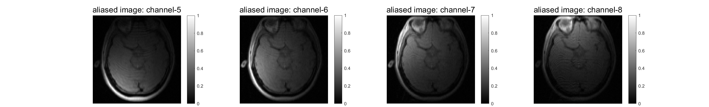</img>

<b>Figure 14.</b> Aliased images, R = 4, ACSLine = 48

 

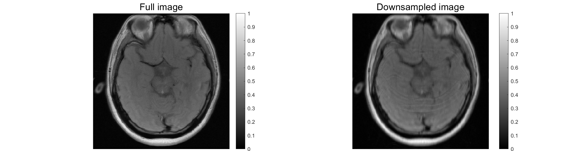</img>
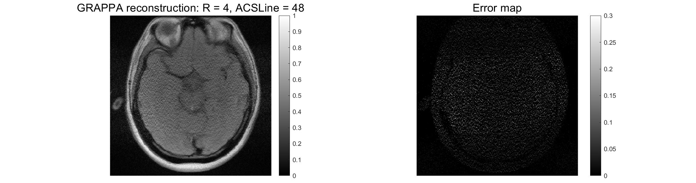</img>

<b>Figure 15.</b> Results of GRAPPA reconstruction, R = 4, ACSLine = 48

 
