# Project 3: CS Reconstruction

 

[TOC]

 

## 1. Theory

### 1.1. Compressive Sensing (CS)

1. Key points of CS in MRI

   - MR signal is sparse in transform domain, for example, wavelet domain.
   - Random sample in k-space will generate incoherent noise in transform domain.

    

2. General formulation of CS in MRI

    $$
    \min_x \Vert \mathfrak{F}_u \Phi^{*} x - y \Vert_2^2 + \lambda \Vert x \Vert_1 \tag{1}
    $$

    in which, $\mathfrak{F}_u$ is the Fourier transform operator. $x = \Phi m$ is sparse transform of the estimated image. $y$ is the acquired k-space data, $\Phi$ is the sparse transform operator. $\lambda$ is a regularization parameter that determines the trade-off between $\Phi$ sparsity and data consistency.

     

### 1.2. Project Over Convex Sets (POCS)

1. Soft thresholding
    $$
    \min_m \; \frac{1}{2} \Vert x - y \Vert_2^2 + \lambda \Vert x \Vert_1,\; x,y \in \mathbb{R} \tag{2}
    $$

    The solution to $x$ of equation (2) has a closed form:

    $$
    \hat{x} =
    \begin{cases}
    y + \lambda \quad & \mathrm{if} \quad y \lt -\lambda \\
    0 \quad & \mathrm{if}  \quad |y| \le \lambda \\
    y - \lambda \quad & \mathrm{if} \quad y \gt \lambda
    \end{cases} \tag{3}
    $$

    if $x \in \mathbb{C}$, the solution is

    $$
    \hat{x} =
    \begin{cases}
    0 \quad & \mathrm{if} \quad |y| \le \lambda \\
    \frac{|y|-\lambda}{|y|}y \quad & \mathrm{if} \quad |y| \gt \lambda
    \end{cases} \tag{4}
    $$

     

2. Implement CS by POCS

    Let

    $$
    \begin{aligned}
    & p :\; \mathrm{probability\; distribution\; function} \\
    & m :\; \mathrm{variable\;density\; random\; mask}
    \end{aligned}
    $$

    Then the implementation of CS by POCS is as below:

    $$
    \begin{aligned}
    & d = y \; .* \; m \\
    & \mathrm{x} = \mathfrak{F}_u^{*}(y \; ./ \; p) \\
    & \mathrm{while\; k \lt maxIter} \\
    & \qquad x = \Phi' * \mathrm{SoftThresh}(\Phi x,\; \lambda) \\
    & \qquad x = \mathfrak{F}_u^{*}(\mathfrak{F}_u x \; .* \; (1 - m) + d) \\
    & \mathrm{end}
    \end{aligned}
    $$

     

### 1.3. Nonlinear Conjugate Gradient (NLCG)

1. Let $|x| \approx \sqrt{x^{*}x+\mu}$, where $\mu$ is a positive smoothing parameter. Then the objective function of equation (1) is

    $$
    \begin{aligned}
    f(x) &= \Vert \mathfrak{F}_u \Phi^{*} x - y \Vert_2^2 + \lambda \Vert x \Vert_1  \\
    &\approx \Vert \mathfrak{F}_u \Phi^{*} x - y \Vert_2^2 + \lambda \sqrt{x^{*}x+\mu}
    \end{aligned}\tag{5}
    $$

    And the gradient of equation (5) is

    $$
    \nabla f(x) \approx 2\Phi\mathfrak{F}_u^*(\mathfrak{F}_u \Phi^{*} x - y) + \lambda\frac{x}{\sqrt{x^{*}x+\mu}} \tag{6}
    $$

     

2. Iterative algorithm for $\mathbb{l}_1$-penalized reconstruction. let

    | parameters       |   |
    | ---------------- | - |
    | $y$              | k-space measurements |
    | $\mathfrak{F}_u$ | undersampled Fourier operator |
    | $\Phi$           | sparsifying transform operator |
    | $\lambda$        | a data consistency tuning constant |
    | $\alpha,\;\beta$ | W-P line search parameters |
    | $x$              | the numerical approximation to equation (1) |

     

    Then, the nonlinear conjugate gradient algorithm for the equation (1) is as below:

    $$
    \begin{aligned}
    & \mathrm{\%\;Initialization} \\
    & k=0;\; x=0;\; g_0=\nabla f(x_0);\; \Delta m_0 = -g_0 \\
    & \mathrm{\%\;Iteration} \\
    & \mathrm{while}(||g_k||_2 \gt \mathrm{TolGrad}\;\mathrm{and}\;k \lt \mathrm{maxIter}) \\
    & \qquad \mathrm{\%\;W-P\; linesearch}\\
    & \qquad t = 1; \\
    & \qquad \mathrm{while}(f(x_k+t\Delta x_k) \gt f(x_k) + \alpha t\cdot |g_k*\Delta x_k|) \\
    & \qquad\qquad t = \beta t; \\
    & \qquad \mathrm{end} \\
    & \qquad x_{k+1} = x_k + t\Delta x_k; \\
    & \qquad g_{k+1} = \nabla f(x_{k+1}); \\
    & \qquad \gamma = \frac{||g_{k+1}||_2^2}{||g_k||_2^2}; \\
    & \qquad \Delta x_{k+1} = -g_{k+1} + \gamma\Delta x_{k+1}; \\
    & \qquad k = k + 1; \\
    & \mathrm{end}
    \end{aligned}
    $$

     

## 2. Results

### 2.1. Task 1

> 1. Use POCS for optimization with &lambda; = [0.01, 0.05, 0.1, 0.2] (after normalization). Please sample the original k-space using the variabledensity random mask and probability distribution function. Discuss the influence of &lambda; in your report.

 
- The program execution begins and ends in file `project3.m`.
- Figure 2 shows the optimization results with different $\lambda$. When $\lambda=0.01$, POCS-CS perform best.
 

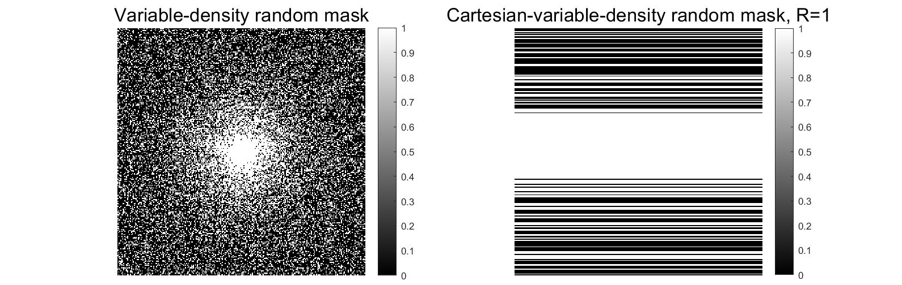</img>
</img>

<b>Figure 1.</b> Variable density mask

 

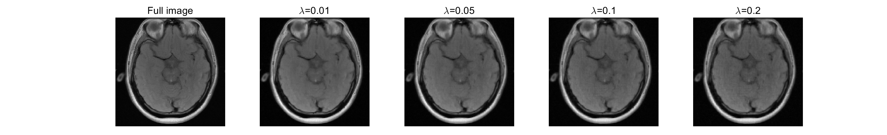</img>
</img>

<b>Figure 2.</b> POCS-CS, with difference lambda

 

### 2.2. Task 2

> 1. Change the sampling scheme to Cartesian sampling with phase-encoding lines randomly distributed (R = 2, 3, 4) and repeat the POCS based CS with &lambda; = 0.01 (after normalization). Can you reconstruct the image?
>  
> 2. Use the nonlinear CG algorithm in the Lustig (2007) MRM paper.

</img>
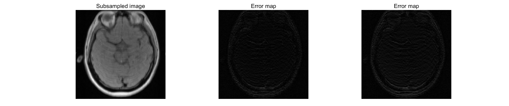</img>

<b>Figure 3.</b> POCS-CS vs. NLCG-CS, with R = 2

 

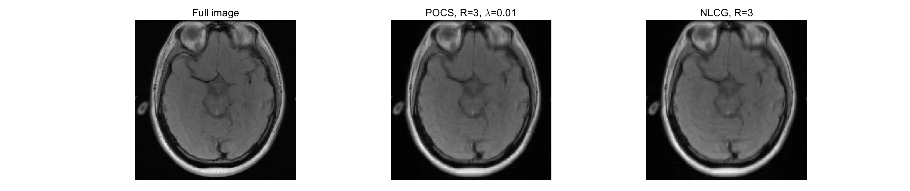</img>
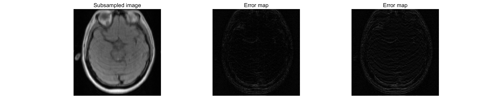</img>

<b>Figure 4.</b> POCS-CS vs. NLCG-CS, with R = 3

 

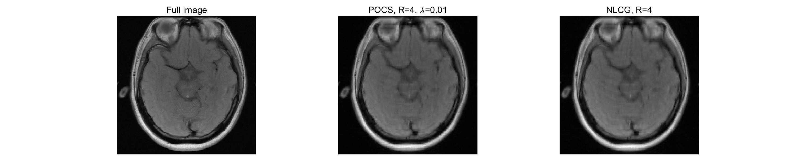</img>
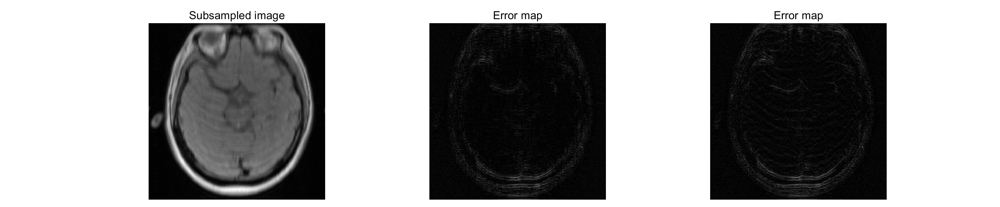</img>

<b>Figure 5.</b> POCS-CS vs. NLCG-CS, with R = 4

 

### 2.3. Task 3

> 1. Compare the reconstruction results between SENSE, GRAPPA, and CS (R = 2, 3, 4). Please discuss the pros and cons of each algorithm in your report.

 

| Methods | pros | cons |
| ------- | ---- | ---- |
| SENSE   | 模型相对简单，重建优化效果好 | 需要sensitivity map |
| GRAPPA  | 不需要sensitivity map | 需要额外的ACS线采集 |
| CS      | 数值求解, 结果优于GRAPPA | equation (1) 往往是非凸的，需要大量的迭代运算 |

 

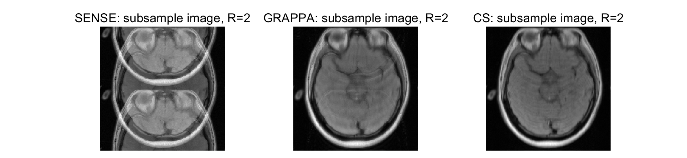</img>
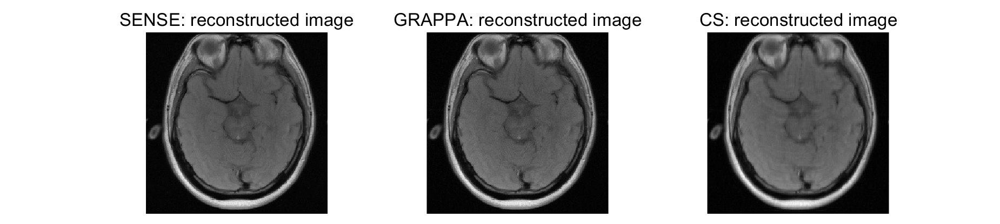</img>
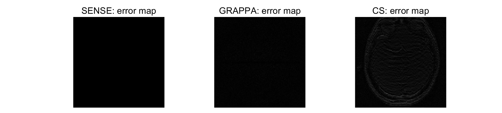</img>

<b>Figure 6.</b> SENSE vs. GRAPPA vs. CS, with R = 2

 

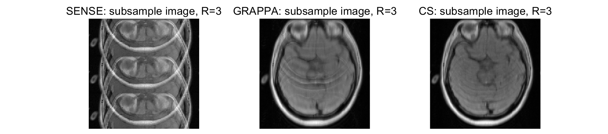</img>
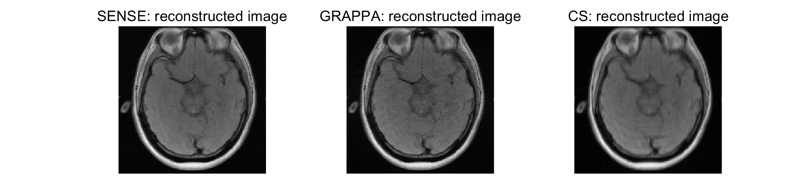</img>
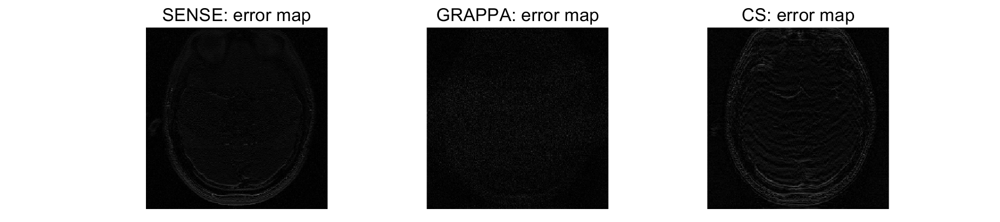</img>

<b>Figure 7.</b> SENSE vs. GRAPPA vs. CS, with R = 3

 

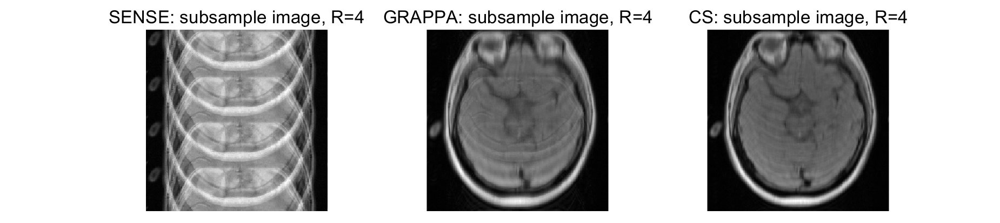</img>
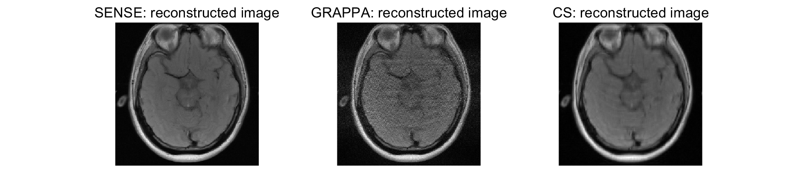</img>
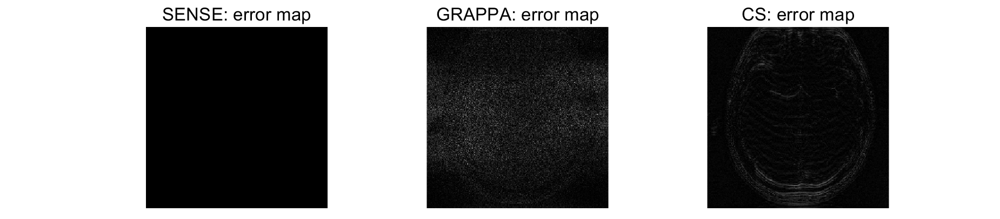</img>

<b>Figure 8.</b> SENSE vs. GRAPPA vs. CS, with R = 4

 
